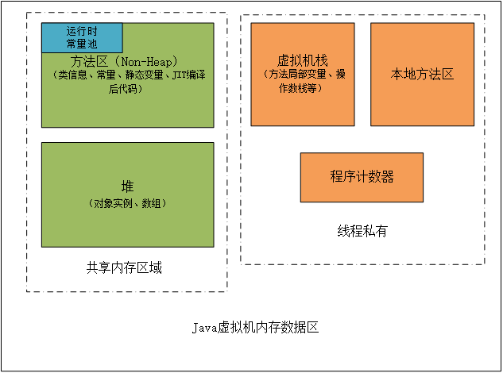

## Java虚拟机内存区域总结

Java虚拟机相当于一个抽象的计算机操作系统，其管理的内从区域大体上可以分为栈和堆，就像c或c++中对内存的分类一样，但这样的分类对于Java虚拟机来说太过粗浅，实际上Java虚拟机管理的内存区域分为**程序计数器、虚拟机栈、本地方法栈、堆和方法区**，根据各区域是属于线程私有还是由线程共享，这些区域可以分为两类，下面分别进行说明。

### 一、线程私有的内存区域

##### 1.程序计数器（Program Counter Register）
程序计数器是一块较小的内存空间，它可以看作是当前线程所执行的字节码的行号指示器。每个线程都有各自独立的程序计数器，如果线程正在执行的是一个Java方法，那么这个计数器记录的是正在执行的虚拟机字节码指令地址，如果正在执行的是Native方法，则程序计数器为空（Undifined）。
** 此内存区域是唯一一个在Java虚拟机规范中没有规定任何OutOfMemoryError情况的区域。**

#### 2.虚拟机栈（VM Stack）
虚拟机栈也是线程私有的，它描述的是Java方法执行的内存模型：**每个方法在执行的同时都会创建一个栈帧（Stack Frame）用于存储局部变量表、操作数栈、动态链接、方法出口等信息，每一个方法从调用直至完成的过程，就对应着一个栈帧在虚拟机栈中入栈和出栈的过程。**
虚拟机栈帧中，局部变量表是比较为人所熟知的，也就是平常所说的“栈”，局部变量表所需的内存空间在编译期间分配完成，当进入一个方法时，这个方法需要在栈帧中分配多大的局部变量空间是完全确定的，在方法运行期间不会改变局部变量表的大小。
虚拟机栈有两种异常情况：
1. StackOverflowError：线程请求的栈深度大于虚拟机所允许的深度，特别是方法的递归调用时
2. OutOfMemoryError：虚拟机栈无法满足线程所申请的空间需求，即使经过动态扩展仍然无法满足，那么将导致OutOfMemoryError错误

#### 3.本地方法栈（Native Method Stack）
本地方法栈与虚拟机栈相似，不过服务于本地方法，有些虚拟机将这两个区域合二为一。
本地方法栈中抛出异常的情况与虚拟机栈相同。

### 二、共享的内存区域

#### 1.堆（Heap）
通常来说，堆是Java虚拟机管理的内存中最大的一块，被所有线程共享，在虚拟机启动时创建，堆的作用就是存储对象实例。
堆也是垃圾收集器所管理的主要区域，因此很多时候也被称作“GC堆”。从内存回收的角度来看，由于现在收集器基本都采用分代收集算法，因此堆还可以被细分为：**新生代和老年代**。再继续细分可以分为：**Eden空间、From Survivor空间、To Survivor空间等**，从内存分配的角度来看，线程贡献的堆中还可以划分出多个线程私有的分配缓冲区u（Thread Local Allocation Buffer，TLAB）。
堆可以是物理上不连续的空间，只要逻辑上是连续的即可，-Xmx和-Xms参数可以控制堆的最大和最小大小。
堆的空间大小不满足时将抛出OutOfMemoryError异常。

#### 2.方法区（Method Area）
用于存储已被虚拟机加载的类信息、常量、静态变量、JIT编译后的代码等数据。Java虚拟机规范将方法区描述为堆的一个逻辑部分，但是它却有一个别名叫做Non-Heap（非堆）。

方法区同样会抛出OutOfMemoryError异常。

		在方法区中有一部分区域用来存储编译期产生的各种字面量和符号引用，这部分内容将在类加载后进入方法区的运行时常量池中存放。
        这里需要说明一点，常量并不是只能在编译期产生，运行期间也会产生新的常量并被发在常量池中，如String类的intern()方法。
        
### 三、直接内存（Direct Memory）
本机直接内存并不是Java虚拟机运行时数据区的一部分，但它能在一些场景中显著提高性能，因为其避免了在Java堆和Native堆中来回复制数据。

直接内存同样会抛出OutOfMemoryError异常。